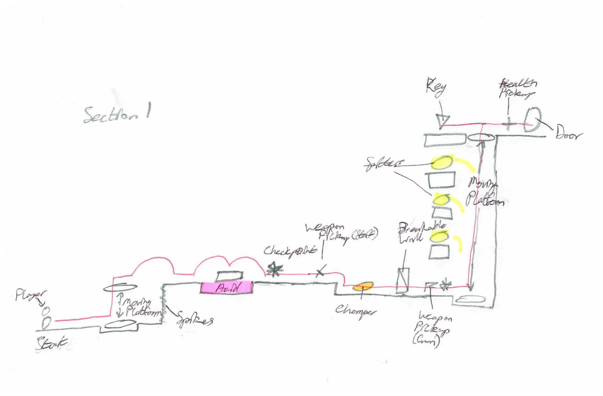

[](https://classroom.github.com/a/YyUO0xtt)
# COMP2150  - Level Design Document
### Name: Alexander Michael Wilson
### Student number: 47785624

This document discusses and reflects on the design of your platformer level for the Level Design assessment. It should be 1500 words. Make sure you delete this and all other instructional text throughout the document before checking your word count prior to submission. Hint: You can check word count by copying this text into a Word or Google doc.

Your document must include images. To insert an image into your documentation, place it in the "DocImages" folder in this repo, then place the below text where you want the image to appear:

```

```

Example:


## 1. Player Experience 

### 1.1. Discovery
In the level I designed the players learn the core mechanics of each individual part of the game in encounters of the first section, separated enough so that they do not get overwhelmed by too many things at once. Each new obstacle is spaced well enough in the short time given that they will understand how each core mechanic works before being combined with others together in later sections of the level. Spreading the encounters this way throughout the level, with clear rest spaces between, encourages the player to learn and understand the core mechanics of the game, and perhaps explore new techniques not originally thought about by the designers. I’m certain there are things I didn’t think about as I designed the encounters that could be done to make things easier, or challenging tricks for skilled players to try having played before. These follow good design practices by rewarding players for their participation and exploration, and encouraging players to come back and try things again with new perspectives.

### 1.2. Drama
The intensity curve has a slow climb throughout the level, having brief recesses after each small spike of activity. It climbs as each new obstacle is presented, incorporating new mechanics or a combination of previously seen ones. As the player progresses they become more comfortable with the core mechanics and so the difficulty of encounters climbs to match their progress. The intensity peaks as they reach the third section of the stage, where all their skills are tested in small spaces, and many different obstacles are presented together. The only relief here comes from where the player clears out the space, finally reaching the goal at the end of the level. The design facilitates this experience by pressing the player onward to each new encounter, presenting new and tougher challenges without a completely overwhelming amount of new information. Each of these is followed by a short space to calm down and prepare for the next encounter, being able to mark progress in a clear way for the player.

### 1.3. Challenge
The main challenges in the level are learning the depths of each of the core mechanics and progressing through each of the encounters. Each encounter is designed to slowly introduce each of the core mechanics to the player, so that they can learn how to overcome more challenging encounters in later segments of the level, though more new concepts are introduced to the player as they progress through each of the introductory encounters. This way the challenge still continues to climb slowly while the player progresses through the early encounters before starting to increase it further with more complex encounters after all introductions are complete. As the encounters progress this way the difficulty curve climbs at an fairly even pace throughout the level, though some players will still grasp the concepts quicker than others. As long as the player has some understanding of the mechanics in the first section of the level, they will be able to complete the rest of the level without losing focus.

### 1.4. Exploration
The level design has a mostly linear path, with spaces unreachable even if the player tries to reach it, or leading nowhere. However, there are parts of the level that branch in different directions, requiring the player to explore to find not only the right path, but also every key that they need to pass the level. Throughout the level there are no signs directly pointing the player in a specific direction, requiring some exploration from the player to find the correct path forward. The design manages to create distinct spaces by not having areas designs be repeats of each other, no space is directly the same. Each space also has some defining characteristic or unique encounter to separate itself from other rooms, leading to unique and memorable spaces for the player to explore. Of course, some rooms will stand out more than others, and therefore be better remembered, but each room being different from each other makes it easier for the player to navigate without getting confused.

## 2. Core Gameplay (~400 words)
A section on Core Gameplay, where storyboards are used to outline how you introduce the player to each of the required gameplay elements in the first section of the game. Storyboards should follow the format provided in lectures.

Storyboards can be combined when multiple mechanics are introduced within a single encounter. Each section should include a sentence or two to briefly justify why you chose to introduce the mechanic/s to the player in that sequence.

You should restructure the headings below to match the order they appear in your level.

### 2.1. Spikes & Moving Platforms

### 2.2. Acid & Checkpoints

### 2.3. Weapon Pickup (Staff), Chompers & Breakable Walls

### 2.4. Weapon Pickup (Gun), Spitters, Health Pickups & Keys

### 2.5. Passthrough Platforms


## 3. Spatiotemporal Design
A section on Spatiotemporal Design, which includes your molecule diagram and annotated level maps (one for each main section of your level). These diagrams may be made digitally or by hand, but must not be created from screenshots of your game. The annotated level maps should show the structure you intend to build, included game elements, and the path the player is expected to take through the level. Examples of these diagrams are included in the level design lectures.

No additional words are necessary for this section (any words should only be within your images/diagrams).
 
### 3.1. Molecule Diagram

### 3.2. Level Map – Section 1



### 3.3.	Level Map – Section 2


### 3.4.	Level Map – Section 3

## 4. Iterative Design (~400 words)
Reflect on how iterative design helped to improve your level. Additional prototypes and design artefacts should be included to demonstrate that you followed an iterative design process (e.g. pictures of paper prototypes, early grey-boxed maps, additional storyboards of later gameplay sequences, etc.). You can also use this section to justify design changes made in Unity after you drew your level design maps shown in section 3. 

You should conclude by highlighting a specific example of an encounter, or another aspect of your level design, that could be improved through further iterative design.

## Generative AI Use Acknowledgement

Use the below table to indicate any Generative AI or writing assistance tools used in creating your document. Please be honest and thorough in your reporting, as this will allow us to give you the marks you have earnt. Place any drafts or other evidence inside this repository. This form and related evidence do not count to your word count.
An example has been included. Please replace this with any actual tools, and add more as necessary.


### Tool Used: ChatGPT
**Nature of Use** Finding relevant design theory.

**Evidence Attached?** Screenshot of ChatGPT conversation included in the folder "GenAI" in this repo.

**Additional Notes:** I used ChatGPT to try and find some more relevant design theory that I could apply to my game. After googling them, however, I found most of them were inaccurate, and some didn't exist. One theory mentioned, however, was useful, and I've incorporated it into my work.

### Tool Used: Example
**Nature of Use** Example Text

**Evidence Attached?** Example Text

**Additional Notes:** Example Text


