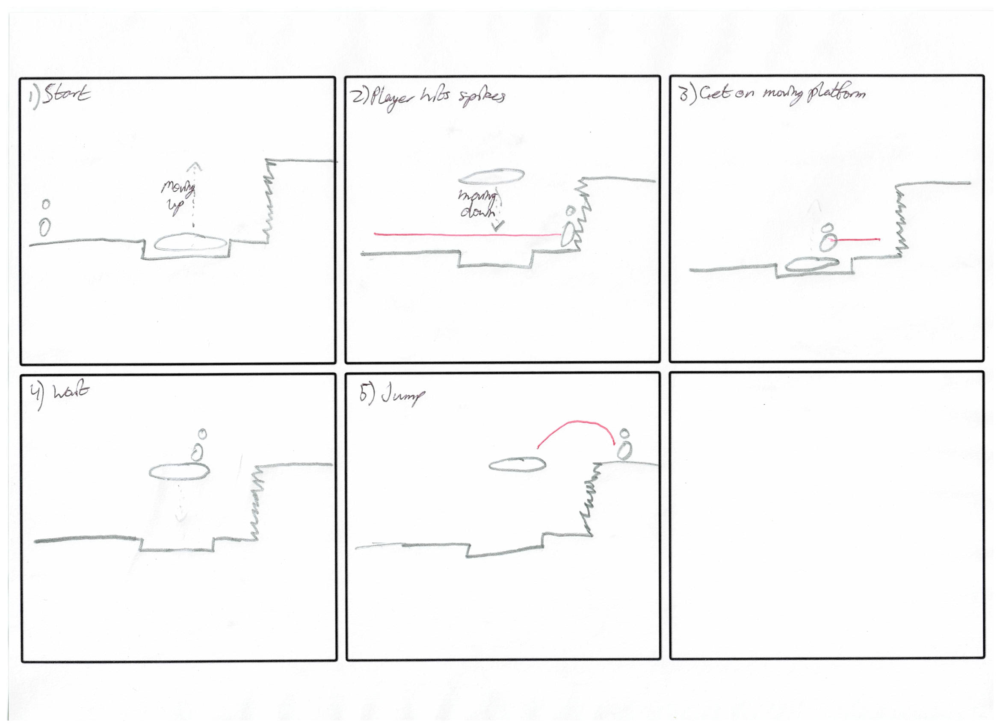
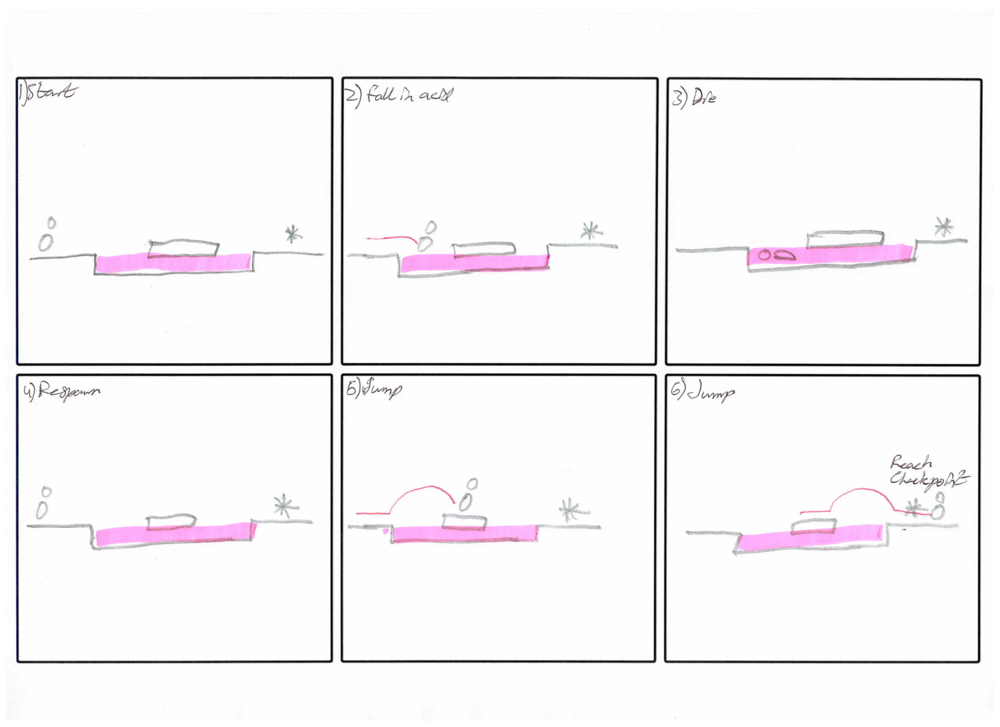
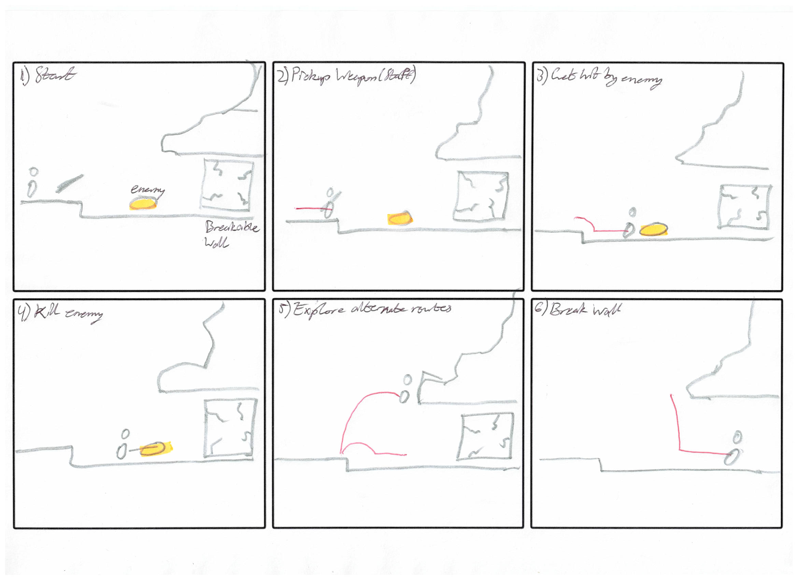
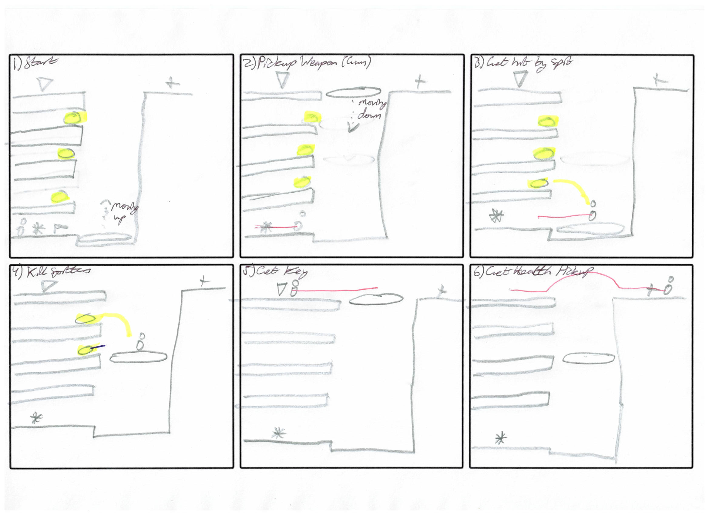
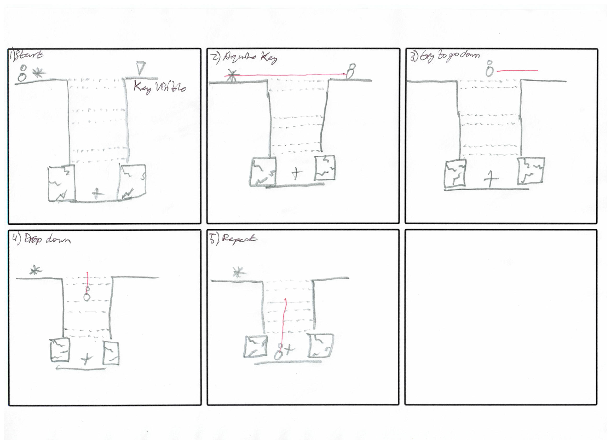
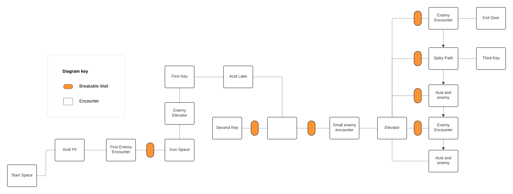
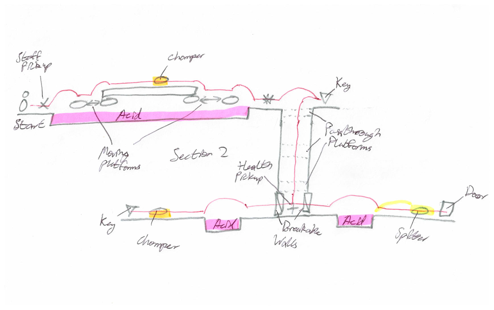
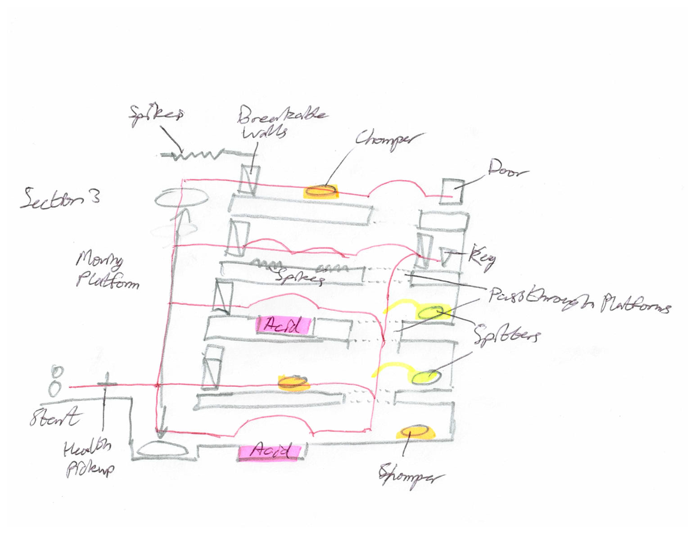

# COMP2150  - Level Design Document
### Name: Alexander Michael Wilson
### Student number: 47785624

## 1. Player Experience 

### 1.1. Discovery
In the level I designed the players learn the core mechanics of each individual part of the game in encounters of the first section, separated enough so that they do not get overwhelmed by too many things at once. Each new obstacle is spaced well enough in the short time given that they will understand how each core mechanic works before being combined with others together in later sections of the level. Spreading the encounters this way throughout the level, with clear rest spaces between, encourages the player to learn and understand the core mechanics of the game, and perhaps explore new techniques not originally thought about by the designers. I’m certain there are things I didn’t think about as I designed the encounters that could be done to make things easier, or challenging tricks for skilled players to try having played before. These follow good design practices by rewarding players for their participation and exploration, and encouraging players to come back and try things again with new perspectives.

### 1.2. Drama
The intensity curve has a slow climb throughout the level, having brief recesses after each small spike of activity. It climbs as each new obstacle is presented, incorporating new mechanics or a combination of previously seen ones. As the player progresses they become more comfortable with the core mechanics and so the difficulty of encounters climbs to match their progress. The intensity peaks as they reach the third section of the stage, where all their skills are tested in small spaces, and many different obstacles are presented together. The only relief here comes from where the player clears out the space, finally reaching the goal at the end of the level. The design facilitates this experience by pressing the player onward to each new encounter, presenting new and tougher challenges without a completely overwhelming amount of new information. Each of these is followed by a short space to calm down and prepare for the next encounter, being able to mark progress in a clear way for the player.

### 1.3. Challenge
The main challenges in the level are learning the depths of each of the core mechanics and progressing through each of the encounters. Each encounter is designed to slowly introduce each of the core mechanics to the player, so that they can learn how to overcome more challenging encounters in later segments of the level, though more new concepts are introduced to the player as they progress through each of the introductory encounters. This way the challenge still continues to climb slowly while the player progresses through the early encounters before starting to increase it further with more complex encounters after all introductions are complete. As the encounters progress this way the difficulty curve climbs at an fairly even pace throughout the level, though some players will still grasp the concepts quicker than others. As long as the player has some understanding of the mechanics in the first section of the level, they will be able to complete the rest of the level without losing focus.

### 1.4. Exploration
The level design has a mostly linear path, with spaces unreachable even if the player tries to reach it, or leading nowhere. However, there are parts of the level that branch in different directions, requiring the player to explore to find not only the right path, but also every key that they need to pass the level. Throughout the level there are no signs directly pointing the player in a specific direction, requiring some exploration from the player to find the correct path forward. The design manages to create distinct spaces by not having areas designs be repeats of each other, no space is directly the same. Each space also has some defining characteristic or unique encounter to separate itself from other rooms, leading to unique and memorable spaces for the player to explore. Of course, some rooms will stand out more than others, and therefore be better remembered, but each room being different from each other makes it easier for the player to navigate without getting confused.

## 2. Core Gameplay

### 2.1. Spikes & Moving Platforms

For the first encounter introducing players to the game I wanted an easy, low stakes challenge. Hence spikes being easily avoidable, and only hurting the player without requiring a respawn. The moving platform here also seemed like a good point to introduce them to timed events, with no real consequences to worry about.

### 2.2. Acid & Checkpoints

Here raising the stakes slightly seemed like a good idea, by having a small easily jumpable pit of acid before the player with a platform in the middle. A checkpoint is also right after this as having two encounters without a checkpoint for the player seems too harsh for an early level. The checkpoint also works as extra motivation for the player to cross the acid pit without falling in.

### 2.3. Weapon Pickup (Staff), Chompers & Breakable Walls

With the first of the weapon pickups I wanted to showcase all of its uses in the encounter. To do so I placed a Chomper to introduce the player to enemy characters, and to encourage the player to fight. Doing so would get the player used to the distance and small lunge of the swing attack. It would also show the breakable walls that they would need to hit a few times in order to proceed. The walls use here is also partially an aesthetic choice, to fit with the cave entrance idea as the player enters a large cave network for the rest of the level.

### 2.4. Weapon Pickup (Gun), Spitters, Health Pickups & Keys

Introducing the gun felt best to me with some kind of shooting range concept. So taking this idea the player is confronted with Spitters in spaces up the wall next to the moving platform here to shoot at as they ride the platform up. It gives players a decent idea of the range of the Spitters, their attack style and how to dodge them. It also encourages the player to shoot them as they pass by, hopefully getting players to react quickly with a shot as they pass. It also shows the player their first health pickup and key at the top of the moving platform. The key is both to encourage them to explore all paths, being on the opposite side to where they need to go, as well as showing them the collectible they need. The health pack is there as the player has likely taken some hits by now.

### 2.5. Passthrough Platforms

The passable platforms here are done so that the player can return to the top if they miss a collectible of some kind that they need, instead of a drop locking them off. I don’t want to leave a possibility of not completing the level.

## 3. Spatiotemporal Design

### 3.1. Molecule Diagram

### 3.2. Level Map – Section 1

### 3.3.	Level Map – Section 2

### 3.4.	Level Map – Section 3

## 4. Iterative Design 
Iterative design has only slightly improved my level. Most of the changes I made during the design process from start to finish was replacing some objects that I felt were underused with others that I felt were a little overused, such as replacing the acid in the lower part of section two with spikes, as they were not very commonly used at all, or simply moving things around so that things flowed more cleanly. Again in the second section, as I initially had some misunderstandings about the assignment, had an extra key. In Unity, I moved the health pickup here and the checkpoint down the platforms. The last section also had several changes made. Several more health pickups were spread around so that the player has plenty of extra health while navigating, the acid pits were made smaller as it was difficult to almost impossible to clear the jump initially, and an extra Chomper was added to the top level. The key and door cave spaces were also pushed back and expanded slightly to make them seem more impressive and memorable.

This level would probably benefit from further iterative design revisions in order to improve the player experience, however, I think more spaces would need to be added, or existing spaces expanded, for it to have the greatest possible effect. The middle section would be the most interesting space to add some interesting and fun new challenges with the extra space. The acid pit at the top especially could lead to some cool new ideas, perhaps with level puzzles and using the gun to trigger them, or pushing blocks to form a path. The space below could be moved to the top to accommodate some of those interesting new ideas.
